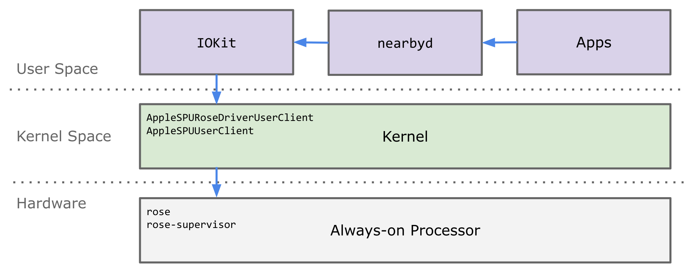

Apple Rose U1
-------------

U1 is Apple's Ultrawide Band chip. This repository contains some information about it as well as additional scripts.

### Contents

* [Frida script](scripts/rose_sniff_kernel.js) for sniffing `nearbyd`<->U1 commands
* [Slides](assets/blackhat_defcon_2021_slides.pdf) of our Black Hat + DEF CON talk

### TL;DR version of the talks

On iOS, watchOS and audioOS, the U1 chip is controlled via the Always-on Processor (AOP). The kernel has two IOKit
`UserClients`, which interact with U1 through the AOP. This indirect communication makes everything a bit more
complicated, but also enhances security---U1 never passes over-the-air packets directly to the kernel, only
abstracted distance measurements. The overall architecture looks as follows:

All of this is a bit unreadable until resolving method names in the kernel as well as command and property names.
The [Frida script](scripts/rose_sniff_kernel.js) resolves all of these names, giving one some idea about what
is happening and what to hook. This script was tested on the iPhone 11+12 with iOS versions 13.3, 14.1, 14.2.1 and 14.3.
Note that you will need an iPhone 11 or 12, since older models as well as the iPhone SE 2020 do not have the U1 chip.

